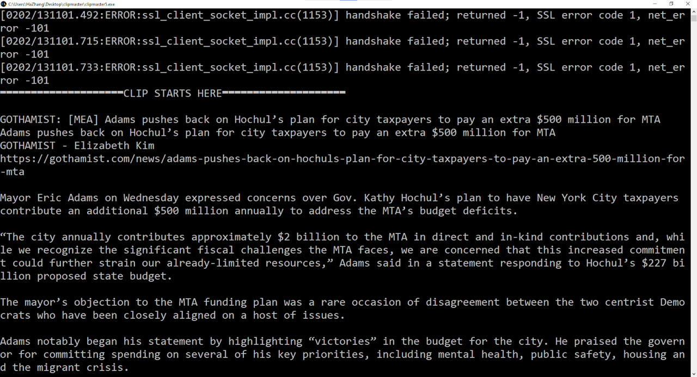

Clipmaster is a web-scraping and text-cleaning program that stemmed from my winter 2023 internship at NYC Mayor's Office of Research and Media Analysis. I was responsible for monitoring news coverage of Mayor Eric Adams and sending formatted clippings of articles to senior City Hall staff. To expedite the process and automate the screening for relevant key words, I created Clipmaster which uses browser automation to scrape an article, identifies and excludes non-content text according to a customizable rules sheet. You can access [the project's source code](https://github.com/hanwzhang/clipmaster) on GitHub.

Clipmaster selectively scrapes text from a website using rules defined by the user in the site configurations workbook. In the workbook, users can define what HTML tags and classes to include or exclude, and which key words to screen for. This setup allows any user with preliminary HTML knowledge to configure the program without having to learn to code. For example:

* Users can identify the HTML classes of different types of texts on a news website and tell Clipmaster to extract the title, author, outlet, and content of articles while leaving out ads and subscription messages.
* Users can set up detection for "Adams, adams, Eric Adams", so that Clipmaster identifies these variations of the mayor's title and generates a label if any of them are found in the article.

When the work is done, Clipmaster outputs the formatted clip into the console while also copying it to clipboard. The clip is ready for sending!

Since the piloting of my program in February 2023, my colleagues have gone a long way to automate media analysis at the Mayor's Office. Clipmaster became the inspiration for a more automated program integrated to their workflow. As my first attempt at applying data science knowledge to real-world policy analysis, it continues to be a great source of pride.